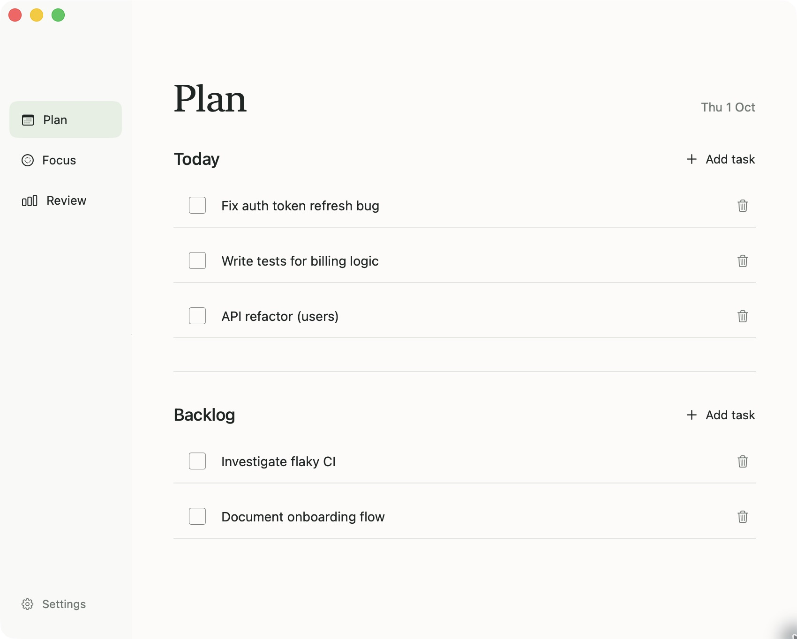
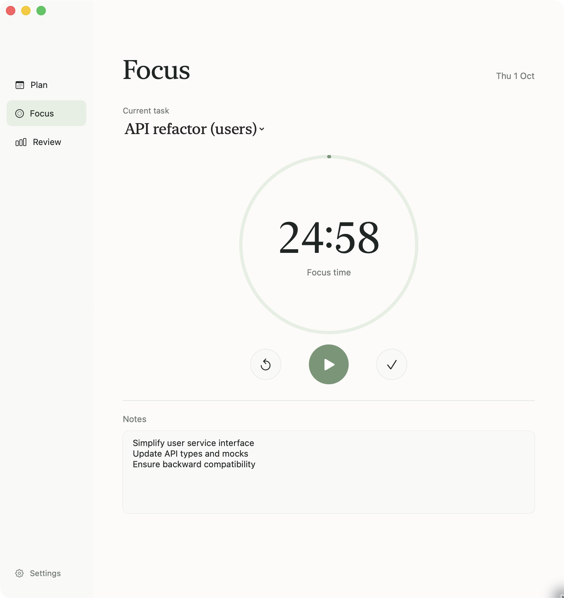
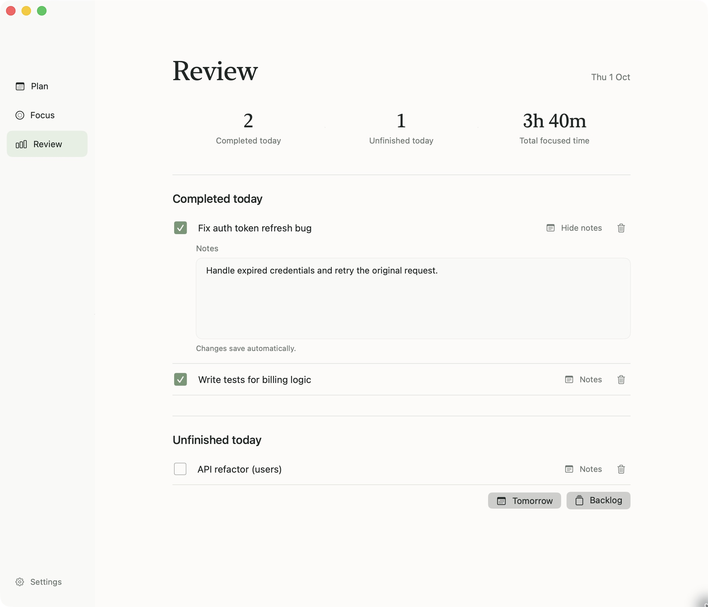

# Planador

A native macOS app for managing your day. Keep tasks in a backlog, choose what to do today, focus on one task at a time with a timer and notes, then review what you accomplished.

## Screenshots

These screenshots show the app with sample tasks.

### Plan



### Focus



### Review



## Requirements

- macOS 14 or later
- Xcode 27 or later to build from source

## Build and run

Open `Planador.xcodeproj` in Xcode and run the **Planador** scheme. The project has no third-party dependencies.

For a release build from the command line:

```sh
xcodebuild -project Planador.xcodeproj -scheme Planador -configuration Release \
  -derivedDataPath DerivedData -destination 'platform=macOS' build CODE_SIGNING_ALLOWED=NO
```

The app is produced at `DerivedData/Build/Products/Release/Planador.app`. Builds from this repository are unsigned. Signing and notarization are required before distributing the app to other Macs.

## Tests

```sh
xcodebuild -project Planador.xcodeproj -scheme Planador -configuration Debug \
  -derivedDataPath DerivedData -destination 'platform=macOS' test CODE_SIGNING_ALLOWED=NO
```

## Data

Tasks, notes, timer state, and focus sessions are saved as JSON at `~/Library/Application Support/Planador/data.json`. The app keeps a copy if it finds a data file it cannot decode. No account or network service is used.

## Workflow

- **Plan:** Switch between Today, Tomorrow, and Upcoming. Unfinished work from earlier days stays in **Carried over**, including in Review and the focus picker. Upcoming groups scheduled tasks by date; its date picker lets you add work for any later day. Backlog is always available below the selected day.
- **Task controls:** Click a title to edit it inline; Return or leaving the field saves, and Escape cancels. Use the play button to focus, the calendar button to schedule, and the notes button to edit details. Drag a task by its handle onto another row to insert before it, onto a list's drop area to append, or onto Today / Tomorrow / Upcoming to schedule it there. Dropping onto Upcoming uses the date shown in that view. The context menu also offers keyboard-accessible movement actions.
- **Focus:** Pick one task and start a focus session. Completing it selects the next task without stopping or resetting the timer; if no tasks remain, the timer still runs to the end of the session. At the end, a chime plays, the Dock icon asks for attention, and the timer stops on a clear pause screen. Click **Start break** when you are ready, or skip it. A second chime marks the end of the break; the next focus session waits for you to click Start. You can pause or reset a running timer and keep task notes. Only focus time counts toward the daily total.
- **Review:** See today's completions, unfinished tasks, and focused time. Expand notes inline on completed tasks, including work finished on earlier days. Send unfinished tasks to tomorrow or back to the backlog, or delete any task from its row.

- **Search:** Find titles and notes across active, future, carried-over, and completed tasks. Multiple search words must all match, and matching ignores case and accents. Search results support editing, scheduling, completion/reopening, and deletion.
- **Menu-bar timer:** View the countdown, select a task, start/pause/reset, complete a task, and start or skip a break without reopening the main window. Closing the window keeps the app and timer available in the menu bar. Quit Planador to exit.
- **Undo and redo:** Use the standard Edit menu or Command-Z / Shift-Command-Z for task creation, edits, movement, completion/reopening, and deletion. Undo restores task state while preserving the timer and recorded focus sessions. Undo history lasts for the current app session and is cleared when restoring a backup.

Set the default focus and break lengths in **Settings**. Changes take effect when the next timer starts. The app includes distinct focus and break completion chimes. Optional completion banners can be enabled in Settings; macOS asks for notification permission when you enable them.

## Keyboard shortcuts

| Action | Shortcut |
| --- | --- |
| Add a task to Today | Command-N |
| Search all tasks | Command-F |
| Open Plan / Focus / Review | Command-1 / Command-2 / Command-3 |
| Start, resume, or pause the timer | Shift-Command-P |
| Undo / redo | Command-Z / Shift-Command-Z |

## Backup and restore

In Settings, **Export backup** saves a JSON file containing tasks, notes, focus sessions, and timer settings. Exporting while a timer runs captures the work logged up to export time without interrupting the live timer. The exported timer is paused so restoring it never counts time spent away as new work.

**Restore backup** validates the selected JSON file, shows its task/session counts, and asks before replacing current data. Before replacement, Planador saves a `before-restore-<id>.json` recovery copy beside `data.json`; the success message shows its path. Invalid backups and write failures leave the current in-memory data intact. Timers remain paused after restore, and this Mac's notification preference is preserved. Existing Planador `data.json` files are also accepted.

The illustration in the request informed the interface; it is not embedded in the app.
